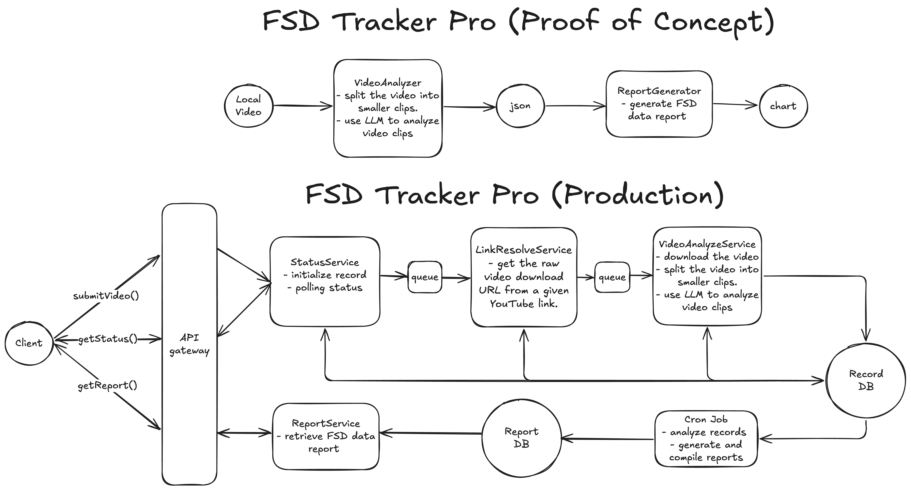

# FSD Tracker Pro

FSD Tracker Pro is an advanced video analysis tool that leverages Google's Generative AI API to identify interesting events and disengagements in your videos. The application processes videos asynchronously by splitting them into clips and analyzing each clip individually, with aggregated results for comprehensive insights.

## System Design & PoC Status

This repository now only contains the proof-of-concept (PoC) implementation. It demonstrates the basic functionalities and system architecture for early feedback and further development. Please note that this is not intended for production use at this stage.



## Driving Events Classification

The Event Enum defined in `fsd_tracker_pro/response_model.py` categorizes driving events into positive and negative events used to evaluate driver performance and safety. The table below merges both classifications and indicates if an event is safety related.

| Event Key                                | Category | Description                                                       | Safety Related |
|------------------------------------------|----------|-------------------------------------------------------------------|----------------|
| SMOOTH_ACCELERATION                      | Positive | Indicates smooth acceleration behavior.                           | No             |
| SMOOTH_BRAKING                           | Positive | Indicates smooth braking performance.                             | No             |
| APPROPRIATE_SPEED_SELECTION              | Positive | Represents proper speed selection under varying conditions.       | No             |
| ACCURATE_LANE_KEEPING                    | Positive | Ensures accurate lane maintenance.                                | No             |
| APPROPRIATE_LANE_CHANGE                  | Positive | Denotes safe and appropriate lane changes.                        | No             |
| CORRECT_TURN_SIGNAL_USE                  | Positive | Signifies correct and timely use of turn signals.                 | No             |
| PROPER_SIGN_AND_LIGHT_COMPLIANCE         | Positive | Denotes adherence to traffic signs and lights.                    | Yes            |
| ACCURATE_ROUTING_AND_NAVIGATION          | Positive | Reflects precise routing and navigation decisions.                | No             |
| CORRECT_ROAD_CONDITION_HANDLING          | Positive | Indicates proper response to road conditions.                     | No             |
| CORRECT_OBSTACLE_AVOIDANCE               | Positive | Indicates effective obstacle avoidance behavior.                  | Yes            |
| SAFE_INTERACTION_WITH_VEHICLES           | Positive | Represents safe interactions with other vehicles.                 | Yes            |
| SAFE_INTERACTION_WITH_PEDESTRIANS          | Positive | Represents safe interactions with pedestrians.                    | Yes            |
| PROPER_INTERACTION_WITH_EMERGENCY_VEHICLES | Positive | Indicates correct handling of interactions with emergency vehicles. | Yes            |
| CORRECT_ROUNDABOUT_HANDLING              | Positive | Denotes proper navigation through roundabouts.                    | No             |
| OTHER_POSITIVE                           | Positive | Miscellaneous positive events.                                    | No             |
| HESITANT_ACCELERATION                    | Negative | Indicates hesitation during acceleration.                         | No             |
| OVERLY_AGGRESSIVE_ACCELERATION           | Negative | Denotes excessively aggressive acceleration.                      | No             |
| ABRUPT_BRAKING                           | Negative | Indicates sudden, unsafe braking.                                 | No             |
| DELAYED_BRAKING                          | Negative | Denotes a delayed braking response.                               | No             |
| INCORRECT_SPEED_SELECTION                | Negative | Represents incorrect speed selection.                             | No             |
| MANUAL_SPEED_ADJUSTMENT_REQUIRED         | Negative | Indicates a situation requiring manual speed adjustment.          | No             |
| LANE_MARKING_FAILURE                     | Negative | Indicates failure to follow lane markings.                        | No             |
| UNNECESSARY_OR_UNSAFE_LANE_CHANGE        | Negative | Denotes unsafe or unnecessary lane changes.                       | No             |
| JERKY_STEERING                           | Negative | Indicates a lack of smooth steering.                                | No             |
| MISSING_OR_INCORRECT_TURN_SIGNAL         | Negative | Denotes missing or incorrectly used turn signals.                 | No             |
| TURN_SIGNAL_NOT_CANCELED                 | Negative | Indicates that the turn signal was not deactivated appropriately.   | No             |
| FAILURE_TO_STOP_AT_SIGN_OR_LIGHT         | Negative | Denotes failure to comply with stop signs or signals.             | Yes            |
| NAVIGATION_ERROR                         | Negative | Represents errors in routing/navigation.                          | No             |
| INCORRECT_ROAD_CONDITION_HANDLING        | Negative | Indicates improper handling of road conditions.                   | No             |
| OBSTACLE_AVOIDANCE_FAILURE               | Negative | Denotes failure to avoid obstacles effectively.                   | Yes            |
| UNSAFE_INTERACTION_WITH_VEHICLES         | Negative | Indicates unsafe interactions with other vehicles.                | Yes            |
| UNSAFE_INTERACTION_WITH_PEDESTRIANS         | Negative | Indicates unsafe interactions with pedestrians.                   | Yes            |
| IMPROPER_RESPONSE_TO_EMERGENCY_VEHICLES   | Negative | Denotes improper reaction to emergency vehicles.                  | Yes            |
| ROUNDABOUT_ERROR                         | Negative | Indicates errors while navigating roundabouts.                    | No             |
| OTHER_NEGATIVE                           | Negative | Miscellaneous negative events.                                    | No             |

## Live Demo

Experience a live demonstration of the analysis on our website: [fsdtracker.pro](https://fsdtracker.pro)

## Features

- **Asynchronous Processing:** Leverages asynchronous file uploads and inference to rapidly analyze videos.
- **Configurable:** Easily adjust video clip lengths, model parameters, and more via a configuration file.
- **Reporting Tools:** Includes scripts to generate detailed reports on event metrics from analyzed videos.

## Requirements

- Python 3.7 or higher

Install dependencies using pip:

```bash
pip install -r requirements.txt
```

## Setup

1. **Environment Variables:** Create a `.env` file in the project root and define your `GEMINI_API_KEY`:

   ```env
   GEMINI_API_KEY=your_api_key_here
   ```

2. **Configuration:** Update `config.yaml` in the project root to adjust settings such as clip length and model parameters.

3. **Running the Analysis:** Execute the main script with the path to your video file:

   ```bash
   python main.py path_to_video.mp4
   ```

## Generating Reports

After processing videos, analysis results are stored in the `results/` directory in JSON format. Use the scripts in the `reports/` directory to generate insightful metrics:

- Generate top negative events:
  ```bash
  python reports/calculate_top_negtive_events.py
  ```
- Calculate positive event ratios:
  ```bash
  python reports/calculate_positive_ratio.py
  ```
- Compute hours per intervention:
  ```bash
  python reports/calculate_hour_per_intervention.py
  ```


## Project Structure

- `fsd_tracker_pro/`
  - `video_analyzer.py`: Core module for processing and analyzing video files using the Gemini API.
  - `post_processor.py`: Handles post-processing and formatting of the analysis results.
  - `response_model.py`: Defines data models for API responses.
  - `video_splitter.py`: Utility module for splitting videos into clips.
  - `config_reader.py`: Reads and parses configuration settings from `config.yaml`.
- `reports/`
  - `calculate_top_negtive_events.py`: Script to generate a report of top negative events detected.
  - `calculate_positive_ratio.py`: Script to compute the ratio of positive events.
  - `calculate_hour_per_intervention.py`: Script to calculate the hours per intervention from analysis data.
- `results/`: Directory containing JSON files with analysis outputs for each processed video.
- `main.py`: Entry point for initiating video analysis.

